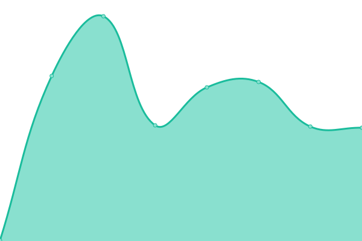

# [📈 Live Status](https://upptime.github.io/upptime): <!--live status--> **🟧 Partial outage**

This repository contains the open-source uptime monitor and status page for [Upptime](https://upptime.js.org), powered by [Upptime](https://github.com/upptime/upptime).

With [Upptime](https://upptime.js.org), you can get your own unlimited and free uptime monitor and status page, powered entirely by a GitHub repository. We use [Issues](https://github.com/upptime/upptime/issues) as incident reports, [Actions](https://github.com/BramB-1952444/upptime/actions) as uptime monitors, and [Pages](https://upptime.github.io/upptime) for the status page.

<!--start: status pages-->
<!-- This summary is generated by Upptime (https://github.com/upptime/upptime) -->
<!-- Do not edit this manually, your changes will be overwritten -->
<!-- prettier-ignore -->
| URL | Status | History | Response Time | Uptime |
| --- | ------ | ------- | ------------- | ------ |
|  [bramboeckx.be](https://bramboeckx.be) | 🟩 Up | [bramboeckx-be.yml](https://github.com/BramB-1952444/uptime/commits/HEAD/history/bramboeckx-be.yml) | 

 276ms
     
 | 

<a href="https://status.bramboeckx.me/history/bramboeckx-be">100.00%</a>
    

|  [Plex](https://plex.bramboeckx.be) | 🟩 Up | [plex.yml](https://github.com/BramB-1952444/uptime/commits/HEAD/history/plex.yml) | 

 2825ms
     
 | 

<a href="https://status.bramboeckx.me/history/plex">99.65%</a>
    

|  [Drank jowile](https://drank.jowile.be) | 🟥 Down | [drank-jowile.yml](https://github.com/BramB-1952444/uptime/commits/HEAD/history/drank-jowile.yml) | 

 2690ms
     
 | 

<a href="https://status.bramboeckx.me/history/drank-jowile">98.06%</a>
    

|  [status](https://status.bramboeckx.be) | 🟥 Down | [status.yml](https://github.com/BramB-1952444/uptime/commits/HEAD/history/status.yml) | 

 0ms
     
 | 

<a href="https://status.bramboeckx.me/history/status">0.00%</a>
    

|  [Blackangusbelgium](https://blackangusbelgium.be/) | 🟩 Up | [blackangusbelgium.yml](https://github.com/BramB-1952444/uptime/commits/HEAD/history/blackangusbelgium.yml) | 

 2708ms
     
 | 

<a href="https://status.bramboeckx.me/history/blackangusbelgium">100.00%</a>
    

<!--end: status pages-->

[**Visit our status website →**](https://upptime.github.io/upptime)

## 📄 License

- Powered by: [Upptime](https://github.com/upptime/upptime)
- Code: [MIT](./LICENSE) © [Upptime](https://upptime.js.org)
- Data in the `./history` directory: [Open Database License](https://opendatacommons.org/licenses/odbl/1-0/)
